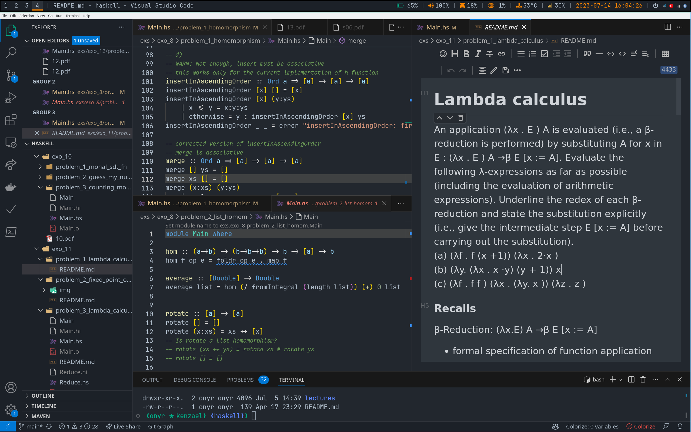

# Personal dotfiles

Here, you can find many of my linux config files I wish to reuse on different machines.

## Useful links

[r/unixporn](https://www.reddit.com/r/unixporn/comments/wc7b33/i3wm_my_functional_first_rice/)

## First time gitifying .config

We can't use `git clone` since the directory is not empty.

1. cd `~/.config`
2. `git init` then `git add <what you want to add>` and `git commit -m "Initial commit."`.
3. Create a repository on GitHub called `dotfiles`, then `git remote add origin <github-repo>`.
4. Make sure current branch is called `main`. You can use `git branch -m main` to rename master to main.
5. Set tracking information for current branch `main` with `git branch --set-upstream-to=origin/main main`.
6. `git pull`.

## Clone inside .config

1. Inside `/home`, `git clone` the `dotfiles` repository from GitHub: `git clone git@github.com:0nyr/dotfiles.git`
2. Copy all already created dotfiles and dotfolders from the old `.config/` to `dotfiles/` with `cp -r .config/* dotfiles/`.
3. Remove the old `.config/` with `rm -rf .config/`.
4. Rename `dotfiles/` to `.config/` with `mv dotfiles/ .config`.
5. Now, you should have merged the online dotfiles with the already created `.config`.

## 🌱Programs

+ **Display server:** [Xorg](https://wiki.archlinux.org/title/xorg)
+ **Window manager:** [i3](https://i3wm.org/)
+ **Status bar:** [Polybar](https://github.com/polybar/polybar)
+ **Lock screen:** [i3lock](https://github.com/i3/i3lock)
+ **Multi-OS live USB:** [ventoy](https://www.ventoy.net/en/index.html)
+ **Screenshot tool:** [shutter](https://shutter-project.org/)
+ **Terminal:** [Kitty](https://github.com/kovidgoyal/kitty)
+ **Shell:** [bash](https://www.gnu.org/software/bash/)
+ **Terminal text editor:** [neovim](https://github.com/neovim/neovim)
+ **Neovim Config:** [astronvim](https://github.com/AstroNvim/AstroNvim)
+ **Application Launcher:** [rofi](https://github.com/davatorium/rofi)
+ **Lock screen:** [i3lock-color](https://github.com/Raymo111/i3lock-color)

## Fonts

### Install fonts from [Nerd Fonts](https://www.nerdfonts.com/#home)

Download the fonts you want, for instance **JetBrainsMono**, `unzip JetBrainsMono.zip`, then `mv *.ttf ~/.fonts/`. Now, update the font cache with `fc-cache -fv`. You can check for installed fonts with `fc-list | grep "SomeFontName"`.

> Remember to use a terminal application that support well Nerd Fonts like [Kitty](https://github.com/kovidgoyal/kitty).

`$ fc-list | grep -i "JetBrains"`: list installed JetBrains fonts

### Build own custom font

[From StackOverflow](https://stackoverflow.com/a/67694013/10798114)

VScode does't allow to use different fonts for comments by default. But it's possible to set comment to be in italic.

```json
"editor.tokenColorCustomizations": {
    "textMateRules": [
        {
            "scope": "comment",
            "settings": {
                "fontStyle": "italic"
            }
        }
    ]
}
```

Knowing this, the trick is to combine the two fonts you want to use with a tool like [FontForge](https://fontforge.org/en-US/) and then set this font into VSCode

```json
"editor.fontFamily": "'CustomJetBrainsMonoNFFantasqueSansMNF', monospace",
    "editor.fontLigatures": true,
```

This font is a combination of 2 Nerd fonts WITH ligatures: `FantasqueSansM Nerd Font` for the italic font, and `JetBrainsMono Nerd Font` for the regular font.

You can find my custom fonts inside `custom_fonts/`.

You can install this font by copying the .ttf files to `~/.fonts/` and, update the font cache with `fc-cache -fv`. Make sure to close all open instances of VSCode for the font reload to be applied.

My VSCode using `CustomJetBrainsMonoNFFantasqueSansMNF`:



You can find my VSCode User `settings.json` [here](./Code/User/settings.json).

## ⭐️ Credits

* Kitty, Rofi and NeoVim: [kabinspace](https://github.com/kabinspace)
* Fonts by [NerdFonts](https://www.nerdfonts.com/#home).
